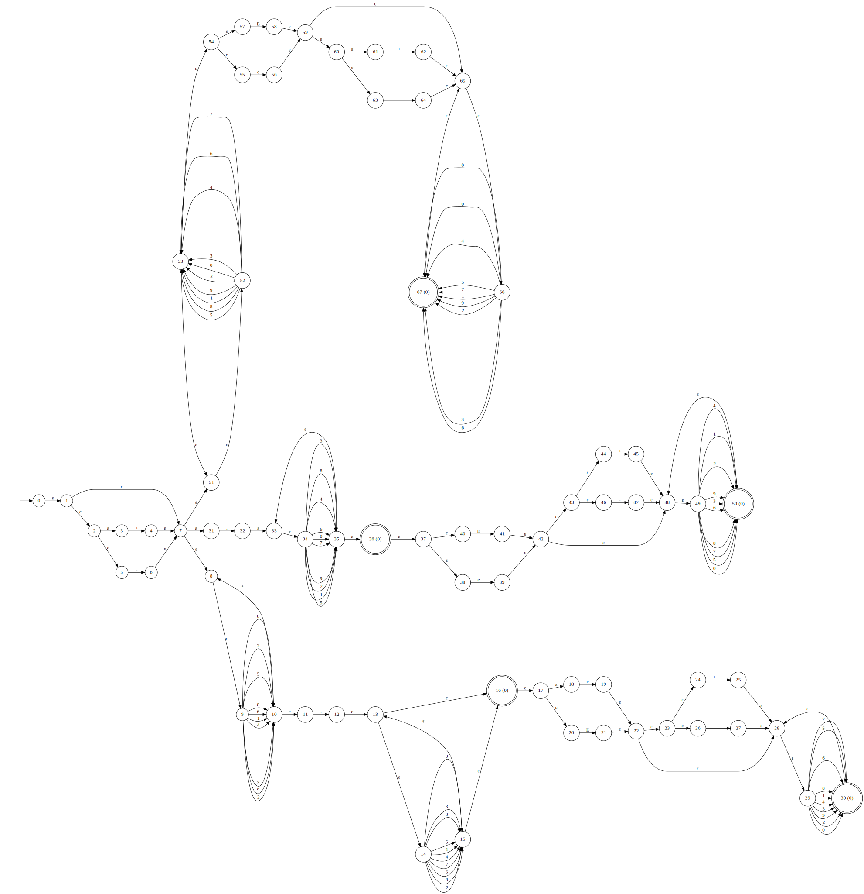

<div style="text-align: center; padding: 20px 0;">
  
</div>

<div style="text-align: center; margin-bottom: 1rem;">
  
  
  
  
  
  
</div>

# **Lexer Library**

`lexer` is a **modern C++23 library** for building fast, flexible lexical analyzers. It provides a **builder-based API**
with composable, regex-like expressions for expressive and customizable token definitions. Inspired by automata theory,
it uses **subset construction** to transform a Non-deterministic Finite Automaton (NFA) into an equivalent Deterministic
Finite Automaton (DFA), ensuring efficient and deterministic tokenization.

## **Features**

- **Highly Flexible Token Definition**

  No predefined tokens, users can manually define tokens by specifying patterns and priorities, making the library
  adaptable to any language or custom syntax.

- **Modern C++23 Syntax**

  Leverages C++23 features such as concise lambdas, enhanced template support, and ranges, improving both readability
  and maintainability.

- **Lightweight and Easy Integration**

  Designed to be **linked into other projects** as a dependency, making it an excellent choice for parsers, compilers,
  and any project requiring lexical analysis.

- **Regex-like Combinators**

  Provides combinator functions (`concat`, `choice`, `plus`, `kleene`, `optional`, `exact`, `at_least`, `range`, etc.)
  to create complex token patterns in an expressive and composable manner.

- **Graphviz Integration for Debugging**

  Optional DOT export for NFAs and DFAs to help debug and visualize automata.

## **Architecture Overview**

- **`lexer::core`**
    - `Builder`: constructs the underlying NFA/DFA from regex combinators.
    - `Lexer`: runtime matcher built from a `Builder`.
- **`lexer::regex`**
    - A small combinator Domain-Specific Language (DSL) for describing token patterns.
- **`lexer::tools::tokenizer`**
    - `Tokenizer`: a streaming wrapper that repeatedly calls `Lexer` and:
        - yields tokens in order,
        - supports string-based input,
        - errors are reported when no registered token matches the current input position.

## **Usage Overview**

### **Defining Token Kinds**

Token kinds are defined as an `enum` or as an integer type directly. Each token kind corresponds to a specific token:

```cpp
enum class Token_kind : uint8_t
{
    // Keywords
    Boolean,
    Char,
    String,
    Int8,
    Uint8,
    Int16,
    Uint16,
    Int32,
    Uint32,
    Int64,
    Uint64,

    // Identifier
    Identifier,

    // Literals
    Integer_literal,
    String_literal,
    Wide_string_literal,
    Character_literal,
    Wide_character_literal,
    Fixed_point_literal,
    Floating_point_literal,

    // Comments
    Single_line_comment,
    Multi_line_comment,
};
```

### **Defining Tokens**

#### **1. Combinator Functions**

Token patterns are built using a small, composable DSL inspired by regular expressions. Each combinator produces a
*pattern object* that can be freely combined with other patterns and later registered with the `Builder`.

Patterns are immutable, lightweight value objects and can be reused across multiple token definitions.

##### **Primitive Combinators**

- `text("abc")`: Matches the exact character sequence `"abc"`.
- `any_of(set)`: Matches any single character contained in the provided character set.

##### **Structural Combinators**

- `concat(p1, p2, ...)`: Matches patterns sequentially from left to right.
- `choice(p1, p2, ...)`: Matches the first successful alternative among the provided patterns.

##### **Repetition Combinators**

- `plus(p)`: Matches one or more repetitions of `p`.
- `kleene(p)`: Matches zero or more repetitions of `p`.
- `optional(p)`: Matches zero or one occurrence of `p`.
- `exact(p, count)`: Matches exactly `count` repetitions of `p`.
- `at_least(p, min)`: Matches `min` or more repetitions of `p`.
- `range(p, min, max)`: Matches between `min` and `max` repetitions of `p`.

##### **Example**

```cpp
using namespace lexer::regex;

// Identifier: [A-Za-z_][A-Za-z0-9_]*
const auto identifier = concat(any_of(Set::alpha() + '_'), kleene(any_of(Set::alphanum() + '_')));
```

#### **2. Builder Methods**

The `lexer::core::Builder` is responsible for collecting token definitions and producing a deterministic lexer. It
represents the *construction phase* of the lexer pipeline.

Once `build()` is called, the resulting `Lexer` is immutable and safe to reuse across multiple inputs.

### add_token(pattern, kind, priority)

Registers a token definition composed of:

- `pattern`: a regex-like combinator expression,
- `kind`: a user-defined token kind (typically an enum),
- `priority`: an integer used to resolve ambiguities.

```cpp
builder.add_token(pattern, Token_kind::Identifier, 4);
```

#### Priority Semantics

- Lower priority values are matched first.
- If multiple token patterns match the same input prefix, the token with the *lowest* priority value is selected.
- Priority resolution is deterministic and performed during DFA construction.

This mechanism allows keyword tokens to override more general patterns such as identifiers.

### build()

```cpp
const auto lexer = builder.build();
```

Finalizes the builder and constructs a `lexer::core::Lexer`.

During this step:

- all registered patterns are combined,
- a Non-deterministic Finite Automaton (NFA) is generated,
- subset construction is applied to produce a Deterministic Finite Automaton (DFA).

After calling `build()`:

- the builder should be treated as immutable,
- the returned lexer can be reused safely and efficiently,
- no further tokens can be added to the same lexer instance.

### Example

```cpp
using namespace lexer;
using namespace lexer::core;
using namespace lexer::regex;

Builder builder;

// Register keyword tokens
builder.add_token(text("boolean"), Token_kind::Boolean, 1);
builder.add_token(text("char"), Token_kind::Char, 1);

// Create and register identifier and literal tokens
const auto identifier{concat(any_of(Set::alpha() + '_'), kleene(any_of(Set::alphanum() + '_')))};
const auto integer_literal{plus(any_of(Set::digits()))};

builder.add_token(identifier, Token_kind::Identifier, 4);
builder.add_token(integer_literal, Token_kind::Integer_literal, 2);

// Build the lexer
const auto lexer{builder.build()};
```

- **Token Patterns**: Patterns can represent fixed strings (e.g., keywords) or complex regex-like expressions (e.g.
  identifiers, literals).
- **Priority**: Lower priority numbers are matched first, enabling conflict resolution for overlapping token patterns
  and ensuring the correct token is selected when multiple patterns match.

### **Tokenization**

Tokenization is performed either **directly through the core lexer** or via a **high-level tokenizer wrapper** that adds
streaming-based input support. This flexibility allows you to choose between performance-focused, one-shot matching or
convenient incremental processing.

The library provides two complementary ways to perform tokenization:

1. **Low-level, one-shot API** via `lexer::core::Lexer`
2. **High-level, streaming API** via `lexer::tools::tokenizer::Tokenizer`

#### **1. Core API (`lexer::core::Lexer`)**

The core lexer performs direct tokenization on containers or iterators. It returns a pair containing the recognized
token kind and the number of characters consumed.

```cpp
using namespace lexer;
using namespace lexer::core;
using namespace lexer::regex;

int main()
{
    enum class Token_kind : uint8_t
    {
        Boolean,
        Char,
        Identifier,
    };

    Builder builder;

    // Define tokens
    builder.add_token(text("boolean"), Token_kind::Boolean, 1);
    builder.add_token(text("char"), Token_kind::Char, 1);

    const auto identifier{concat(any_of(Set::alpha() + '_'), kleene(any_of(Set::alphanum() + '_')))};
    builder.add_token(identifier, Token_kind::Identifier, 4);

    const auto lexer{builder.build()};

    // Tokenize input
    const std::string input = "boolean";
    const auto [token, consumed] = lexer.tokenize<Token_kind>(input);

    std::cout << "Token: " << (token ? std::to_string(static_cast<int>(*token)) : "None") << ", Consumed: " << consumed << '\n';

    return 0;
}
```

You can pass a standard container such as `std::array`, `std::string`, or any range-like input.

```cpp
std::array<char, 5> input = {'1', '2', '3', '4', '\0'};
const auto [token, consumed] = lexer.tokenize<Token_kind>(input);

// token  -> Token_kind::Integer_literal
// consumed -> 4
```

Alternatively, you can tokenize a string using iterators:

```cpp
std::string input = "boolean";
const auto [token, consumed] = lexer.tokenize<Token_kind>(input.begin(), input.end());

// token  -> Token_kind::Boolean
// consumed -> 7
```

In both cases, the lexer returns:

- the **token kind** (`std::optional<Token_kind>`), which is empty if no valid token was matched, and
- the **offset**, representing the number of characters consumed during the match.

This API is efficient and lightweight, suitable for use in parsers or compiler front ends.

#### **2. Tokenizer API (`lexer::tools::tokenizer::Tokenizer`)**

The Tokenizer builds on the core lexer to provide a streaming-based interface. It repeatedly calls the underlying
`core::Lexer`, handling offsets, EOF detection, and error propagation automatically.

```cpp
using namespace lexer;
using namespace lexer::core;
using namespace lexer::regex;
using namespace lexer::tools::tokenizer;

const std::string input = "boolean x 1234";

Tokenizer tokenizer{lexer, input};

for (;;)
{
    const std::expected<std::optional<Token<Token_kind>>, Error> expected = tokenizer.next<Token_kind>();
    if (!expected.has_value())
    {
        // Invalid input or unrecognized symbol
        std::cerr << expected.error().message() << '\n';
        break;
    }

    const std::optional<Token<Token_kind>> optional = expected.value();
    if (!optional.has_value())
    {
        break; // End of input
    }

    const Token<Token_kind> token = optional.value();
    std::cout << "Token kind=" << static_cast<int>(token.kind()) << " lexeme=\"" << token.lexeme() << "\"\n";
}
```

The tokenizer API uses an expected-like result type:

- **Success**: Returns a value containing `std::optional<Token<Token_kind>>` with either the recognized token or EOF (
  `std::nullopt`).
- **Failure**: Returns an error object with position and textual description.

Together, these two layers let you choose between fine-grained control (`core::Lexer`) and convenient streaming-based
processing (`tools::tokenizer::Tokenizer`).

## **Getting Started**

### **Building the Project**

To build the project, ensure you have a C++23-compatible compiler and CMake installed. Run the following commands:

```bash
mkdir build
cd build
cmake ..
make
```

## **Testing**

The project includes unit tests located in the `tests/` directory in the respective library. To run the tests:

```bash
cd build
ctest
```

Ensure all tests pass to verify the library's functionality.

## **Directory Structure**

- `docs/`: SVG diagrams and project logos.
- `libs/core/`: Core lexer implementation including the `Builder` and `Lexer`.
- `libs/regex/`: Regex combinators for defining token patterns (`concat`, `choice`, `kleene`, etc.).
- `libs/dfa/` and `libs/nfa/`: Internal automata modules powering the lexer engine.
- `tools/tokenizer/`: High-level streaming-based tokenization interface.

## **Example CMake Integration**

Here’s a sample `CMakeLists.txt` for integrating the `lexer` library:

```cmake
cmake_minimum_required(VERSION 3.20)
project(MyProject VERSION 1.0 LANGUAGES CXX)

set(CMAKE_CXX_STANDARD 23)
set(CMAKE_CXX_STANDARD_REQUIRED ON)

# Add the lexer library
add_subdirectory(lexer)

# Link the lexer library to your target
add_executable(my_app main.cpp)
target_link_libraries(my_app PRIVATE lexer)
```

## **Debugging and Visualization**

### **Generating Debugging Files**

Debugging is a crucial step in understanding and verifying the behavior of the lexer. The library supports generating
`.dot` files for visualizing NFAs and DFAs, which can help identify issues or optimize the tokenization process. These
files can be converted to `.svg` for easier viewing.

1. Include the appropriate `graphviz` header for NFA or DFA.
2. Call the `to_file` method from the `Graphviz` class, passing the NFA or DFA object and the desired file path to
   generate `.dot` files for debugging.

#### **Converting `.dot` to `.svg`**

Use the `dot` command-line tool from Graphviz to convert `.dot` files to `.svg`:

```bash
dot -Tsvg <name>.dot -o <name>.svg
```

> **Note**: Ensure Graphviz is installed on your system before running these commands. You can download it
> from [Graphviz.org](https://graphviz.org/download/).

### **Visualizing NFAs and DFAs**

Below are examples of how an NFA and its corresponding DFA might look:

#### **Identifier NFA Example**


This image represents the NFA for recognizing identifiers. It shows the states and transitions based on the input
characters. NFAs are useful for understanding the non-deterministic paths that the lexer can take when matching
patterns.

#### **Identifier DFA Example**


This image illustrates the DFA derived from the NFA above. DFAs are deterministic and optimized for fast tokenization,
showcasing the subset construction process and the deterministic transitions.

#### **Floating Point Literal NFA Example**



This NFA visualizes the recognition of floating point literals, demonstrating the complexity of matching numeric
patterns with optional decimal points and exponents.

#### **Floating Point Literal DFA Example**


This DFA is constructed from the floating point literal NFA and shows the deterministic state transitions required to
efficiently recognize floating point numbers.

## **License**

This project is licensed under the terms of the MIT License. See the [LICENSE](LICENSE) file for details.

## **Author**

Developed and maintained by **Nicklas Nidhögg**  
GitHub: [nnidhogg](https://github.com/nnidhogg)
