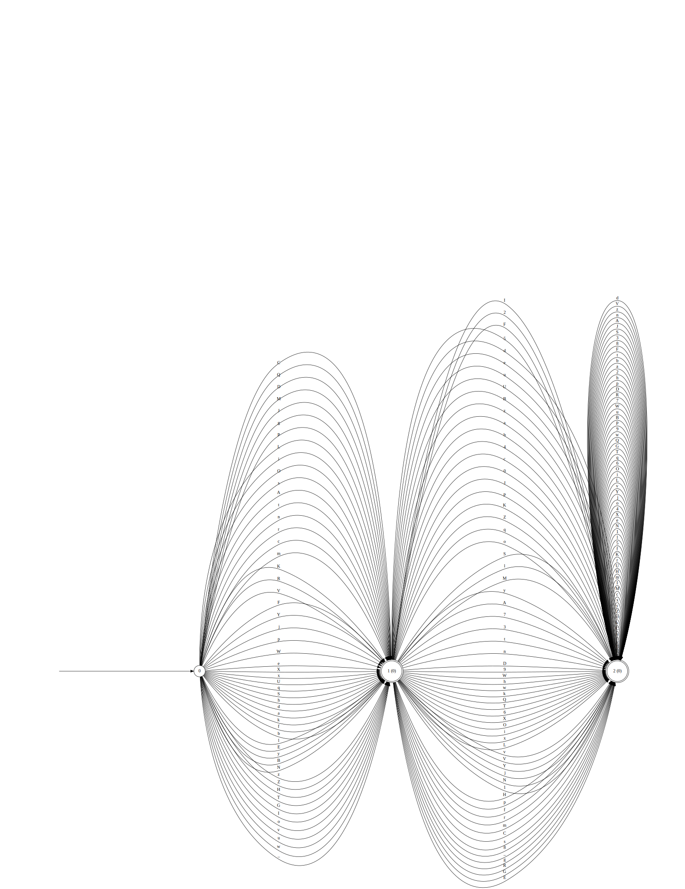
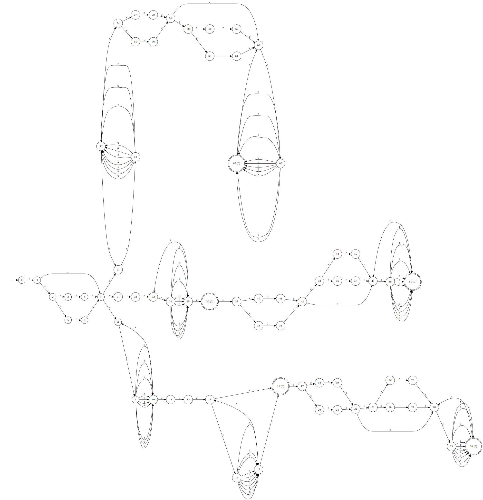
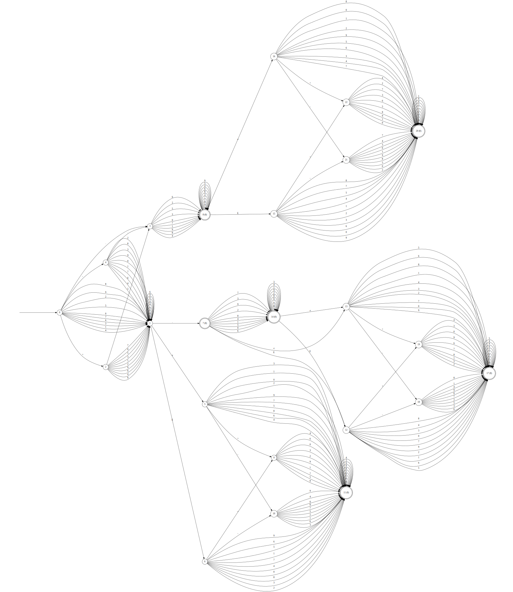

<!-- Metadata for SEO -->
<meta name="description" content="Lexer is a modern, high-performance library leveraging automata theory for flexible and efficient lexical analysis.">
<meta name="keywords" content="lexer, automata theory, lexical analysis, C++23, DFA, NFA, tokenization">
<meta name="author" content="Nicklas Nidhögg">

# **Lexer Library**

[](https://github.com/nnidhogg/lexer/actions/workflows/ci.yml)
[](https://codecov.io/github/nnidhogg/lexer)

`lexer` is a **modern lexer library** leveraging **C++23** features. It provides a **builder-based API** for flexible
and customizable lexical analysis with combinator-based regular expressions. Inspired by automata theory, it uses
**subset construction** to transform a Non-deterministic Finite Automaton (NFA) into an equivalent Deterministic Finite
Automaton (DFA), ensuring fast and reliable tokenization.

## **Features**

- **Highly Flexible Token Definition**  
  No predefined tokens, users can manually define tokens by specifying patterns and priorities, making the library
  adaptable to any language or custom syntax.

- **Modern C++23 Syntax**  
  Leverages C++23 features such as concise lambdas, enhanced template support, and ranges, improving both readability
  and maintainability.

- **Lightweight and Easy Integration**  
  Designed to be **linked into other projects** as a dependency, making it an excellent choice for parsers, compilers,
  and any project requiring lexical analysis.

- **Regex-like Combinators**  
  Provides combinator functions (`concat`, `choice`, `plus`, `kleene`, `optional`, `exact`, `at_least`, `range`, etc.)
  to create complex token patterns in an expressive and composable manner.

## **Usage Overview**

### **Defining Token Types**

Token types are defined as an `enum`:

```cpp
enum class Token_type : uint8_t
{
    // Keywords
    Boolean,
    Char,
    String,
    Int8,
    Uint8,
    Int16,
    Uint16,
    Int32,
    Uint32,
    Int64,
    Uint64,

    // Identifier
    Identifier,

    // Literals
    Integer_literal,
    String_literal,
    Wide_string_literal,
    Character_literal,
    Wide_character_literal,
    Fixed_point_literal,
    Floating_point_literal,

    // Comments
    Single_line_comment,
    Multi_line_comment,
};
```

### **Registering Tokens with the Builder**

Tokens are registered using the `lexer::Builder` API:

```cpp
using namespace lexer;
using namespace lexer::regex;

Builder builder;

// Register keyword tokens
builder.add_token(text("boolean"), Token_type::Boolean, 1);
builder.add_token(text("char"), Token_type::Char, 1);

// Create and register identifier and literal tokens
const auto identifier{concat(any_of(Set::alpha() + '_'), kleene(any_of(Set::alphanum() + '_')))};
const auto integer_literal{plus(any_of(Set::digits()))};

builder.add_token(identifier, Token_type::Identifier, 4);
builder.add_token(integer_literal, Token_type::Integer_literal, 2);

// Build the lexer
const auto lexer{builder.build()};
```

- **Token Patterns**: Patterns can represent fixed strings (e.g., keywords) or complex regex-like expressions (e.g.
  identifiers, literals).
- **Priority**: Lower priority numbers are matched first, enabling conflict resolution for overlapping token patterns
  and ensuring the correct token is selected when multiple patterns match.

### **Tokenization**

`lexer` allows tokenizing input from various sources, including standard containers and iterators. You can pass a
container like `std::array` or provide a pair of iterators for flexible input handling.

```cpp
std::array<char, 5> input = {'1', '2', '3', '4', '\0'};
const auto [token, offset] = lexer.tokenize<Token_type>(input);

// token  -> Token_type::Integer_literal
// offset -> 4
```

Alternatively, you can tokenize a string using iterators:

```cpp
std::string input = "boolean";
const auto [token, offset] = lexer.tokenize<Token_type>(input.begin(), input.end());

// token  -> Token_type::Boolean
// offset -> 7
```

In both cases, the lexer correctly identifies the token and returns both the **token type** and the **length** of the
matched input (offset).

## **API Summary**

### **Combinator Functions**

- `text(...)`: Matches a sequence of characters.
- `any_of(...)`: Matches any character from a specified set.
- `concat(...)`: Concatenates multiple patterns in sequence.
- `choice(...)`: Chooses between multiple patterns.
- `plus(...)`: Matches one or more repetitions of a pattern.
- `kleene(...)`: Matches zero or more repetitions of a pattern.
- `optional(...)`: Matches zero or one occurrence of a pattern.
- `exact(count)`: Matches exactly `count` repetitions of a pattern.
- `at_least(min)`: Matches at least `min` repetitions of a pattern.
- `range(min, max)`: Matches between `min` and `max` repetitions of a pattern.

### **Builder Methods**

- `add_token(pattern, token_type, priority)`: Registers a token with a pattern, type, and priority.
- `build()`: Builds and returns the lexer.

## **Getting Started**

### **Building the Project**

To build the project, ensure you have a C++23-compatible compiler and CMake installed. Run the following commands:

```bash
mkdir build
cd build
cmake ..
make
```

### **Integration**

To integrate the library into your project, include the `include/lexer` directory in your include paths and link the
compiled library.

## **Testing**

The project includes unit tests located in the `tests/` directory. To run the tests:

```bash
cd build
ctest
```

Ensure all tests pass to verify the library's functionality.

## **Directory Structure**

- `src/`: Contains the main implementation files.
- `include/`: Header files for the library.
- `libs/`: Additional modules like `dfa`, `nfa`, and `regex`.
- `tests/`: Unit tests for the library.
- `debug/`: Debugging artifacts such as `.dot` files for NFAs and DFAs.

## **Example CMake Integration**

Here’s a sample `CMakeLists.txt` for integrating the `lexer` library:

```cmake
cmake_minimum_required(VERSION 3.20)
project(MyProject VERSION 1.0 LANGUAGES CXX)

set(CMAKE_CXX_STANDARD 23)
set(CMAKE_CXX_STANDARD_REQUIRED ON)

# Add the lexer library
add_subdirectory(lexer)

# Link the lexer library to your target
add_executable(my_app main.cpp)
target_link_libraries(my_app PRIVATE lexer)
```

## **Using the API**

### **Tokenization Workflow**

The library provides a streamlined workflow for tokenizing input. Here's a step-by-step guide:

1. **Define Token Types**: Use an `enum` to specify the token types.
2. **Register Tokens**: Use the `Builder` API to define token patterns and their priorities.
3. **Build the Lexer**: Call `builder.build()` to create the lexer.
4. **Tokenize Input**: Use the `tokenize` method to process input and extract tokens.

### **Example: Tokenizing a Simple Input**

```cpp
using namespace lexer;
using namespace lexer::regex;

int main()
{
    enum class Token_type : uint8_t
    {
        Boolean,
        Char,
        Identifier,
    };

    Builder builder;

    // Define tokens
    builder.add_token(text("boolean"), Token_type::Boolean, 1);
    builder.add_token(text("char"), Token_type::Char, 1);

    const auto identifier{concat(any_of(Set::alpha() + '_'), kleene(any_of(Set::alphanum() + '_')))};
    builder.add_token(identifier, Token_type::Identifier, 4);

    const auto lexer{builder.build()};

    // Tokenize input
    const std::string input = "boolean";
    const auto [token, offset] = lexer.tokenize<Token_type>(input);

    std::cout << "Token: " << (token ? std::to_string(static_cast<int>(*token)) : "None") << ", Offset: " << offset << '\n';

    return 0;
}
```

### **Generating Debugging Files**

Debugging is a crucial step in understanding and verifying the behavior of the lexer. The library supports generating
`.dot` files for visualizing NFAs and DFAs, which can help identify issues or optimize the tokenization process. These
files can be converted to `.svg` for easier viewing.

1. Include the appropriate `graphviz` header for NFA or DFA.
2. Call the `to_file` method from the `Graphviz` class, passing the NFA or DFA object and the desired file path to
   generate `.dot` files for debugging.

#### **Converting `.dot` to `.svg`**

Use the `dot` command-line tool from Graphviz to convert `.dot` files to `.svg`:

```bash
dot -Tsvg debug/<name>.dot -o debug/<name>.svg
```

> **Note**: Ensure Graphviz is installed on your system before running these commands. You can download it
> from [Graphviz.org](https://graphviz.org/download/).

### **Visualizing NFAs and DFAs**

Below are examples of how an NFA and its corresponding DFA might look:

#### **Identifier NFA Example**


This image represents the NFA for recognizing identifiers. It shows the states and transitions based on the input
characters. NFAs are useful for understanding the non-deterministic paths that the lexer can take when matching
patterns.

#### **Identifier DFA Example**



This image illustrates the DFA derived from the NFA above. DFAs are deterministic and optimized for fast tokenization,
showcasing the subset construction process and the deterministic transitions.

#### **Floating Point Literal NFA Example**



This NFA visualizes the recognition of floating point literals, demonstrating the complexity of matching numeric
patterns with optional decimal points and exponents.

#### **Floating Point Literal DFA Example**



This DFA is constructed from the floating point literal NFA and shows the deterministic state transitions required to
efficiently recognize floating point numbers.

## **License**

This project is licensed under the terms of the MIT License. See the [LICENSE](LICENSE) file for details.
